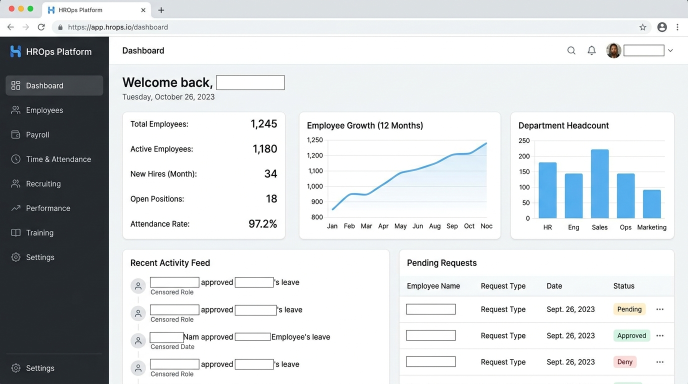
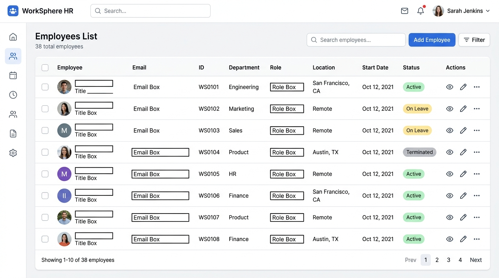
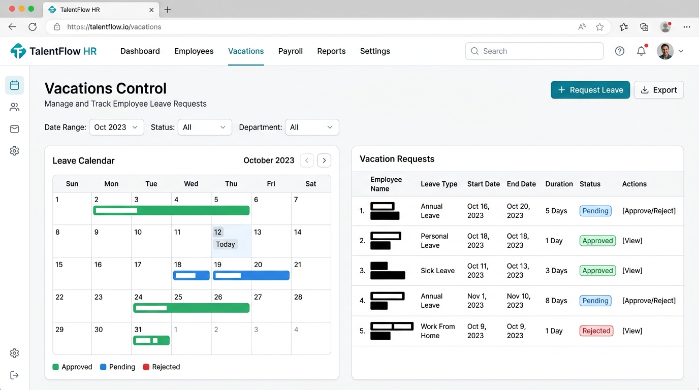
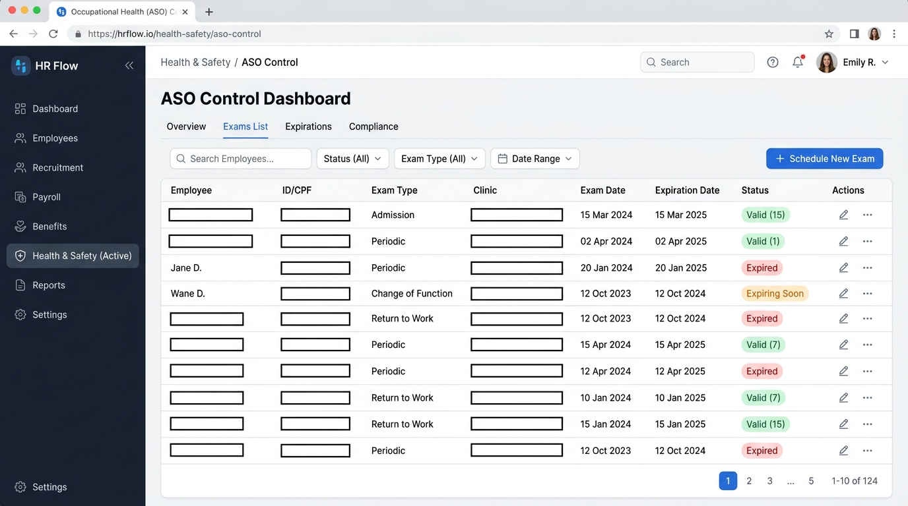

# 🚀 Innovation RH Connect

Sistema corporativo completo e profissional para Gestão de RH, controle de ponto eletrônico digital e comunicação integrada via WhatsApp. Projetado para otimizar a operação de departamento pessoal de pequenas e médias empresas com uma interface moderna, rápida e de alta performance.

---

## 📸 Capturas de Tela (Demonstração)

Conheça as principais interfaces do sistema (dados confidenciais foram ocultados com tarjas para preservar a privacidade):

### 📊 1. Painel Executivo (Dashboard)
Acompanhamento em tempo real de indicadores gerais, pendências de ponto, férias solicitadas, banco de horas e movimentações mensais (admissões e desligamentos) de forma consolidada.


### 👥 2. Gestão de Funcionários
Cadastro completo e listagem de colaboradores com status lógico (Ativos, Inativos, Desligados), filtro por departamento ou matrícula e geração automática de Ficha de Registro em PDF.


### 📅 3. Controle de Férias
Solicitações de férias individuais ou coletivas, acompanhamento do período concessivo e cálculo automático de elegibilidade de dias com base nas faltas injustificadas.


### ⏱️ 4. Folha de Ponto Eletrônica
Espelho de ponto mensal com marcação de entrada, almoço e saída. Cálculo de horas trabalhadas, horas extras (50% e 100%), adicional noturno e saldo diário com visualização limpa de atestados, suspensões e faltas.


### 🩺 5. Saúde Ocupacional & ASO
Gestão de Exames Médicos Ocupacionais (ASO) por funcionário com controle de vencimento, fechamento de períodos de folha e regras de controle interno parametrizáveis.


---

## 🛠️ Stack Tecnológica

### Frontend
- **Framework:** Next.js 14 (App Router)
- **Biblioteca Visual:** React, TailwindCSS, Framer Motion
- **Gráficos & Ícones:** Recharts, Lucide Icons

### Backend
- **Framework:** NestJS (Node.js)
- **Banco de Dados & ORM:** PostgreSQL & Prisma ORM
- **Cache & Filas:** Redis
- **Segurança:** JWT, Helmet, Throttler, Cookie Parser

---

## 🚀 Como Rodar Localmente

1. **Instale as dependências:**
   ```bash
   npm install
   ```

2. **Inicie o banco de dados local via Docker:**
   ```bash
   docker compose -f infra/docker-compose.yml up -d postgres
   ```

3. **Gere o Prisma Client e execute as Migrações:**
   ```bash
   npm run db:generate
   npm run db:migrate
   npm run db:seed
   ```

4. **Inicie os servidores de desenvolvimento:**
   - **Backend API:** `npm run dev:api` (porta `3333` padrão)
   - **Frontend Web:** `npm run dev:web` (porta `3000` padrão)

---

## 🗄️ Comandos de Migrações (Prisma)

Sempre que alterar o schema localizado em `apps/api/prisma/schema.prisma`:

```bash
npm run db:migrate   # Cria e executa uma nova migration
npm run db:deploy    # Executa migrations pendentes em producao
npm run db:studio    # Abre o gerenciador visual do banco
```

---

## 📦 Build de Produção

Para testar o build do projeto unificado:

```bash
npm run typecheck
npm run build
```
