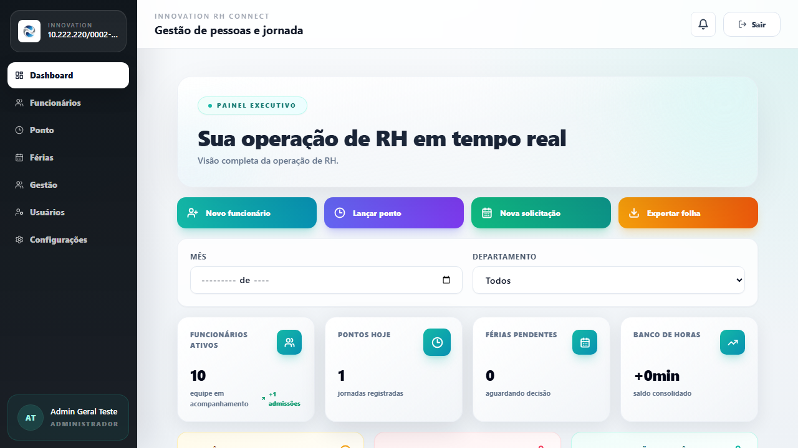
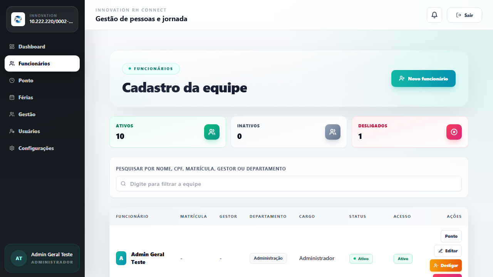
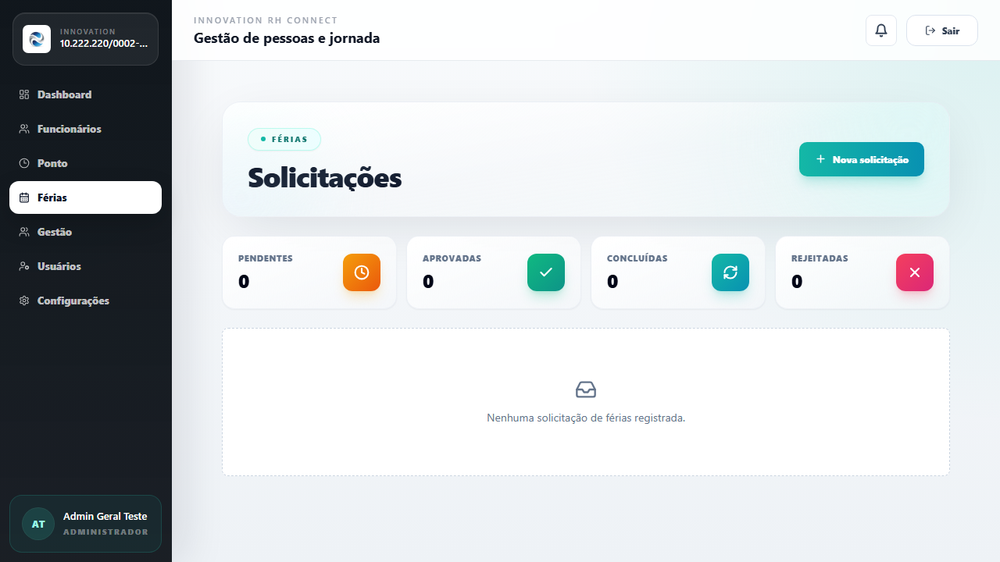
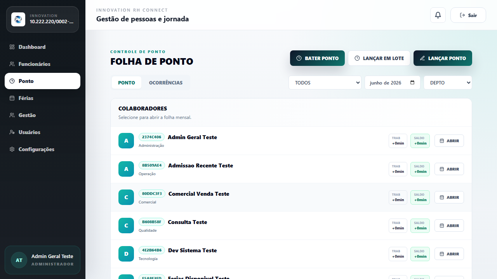
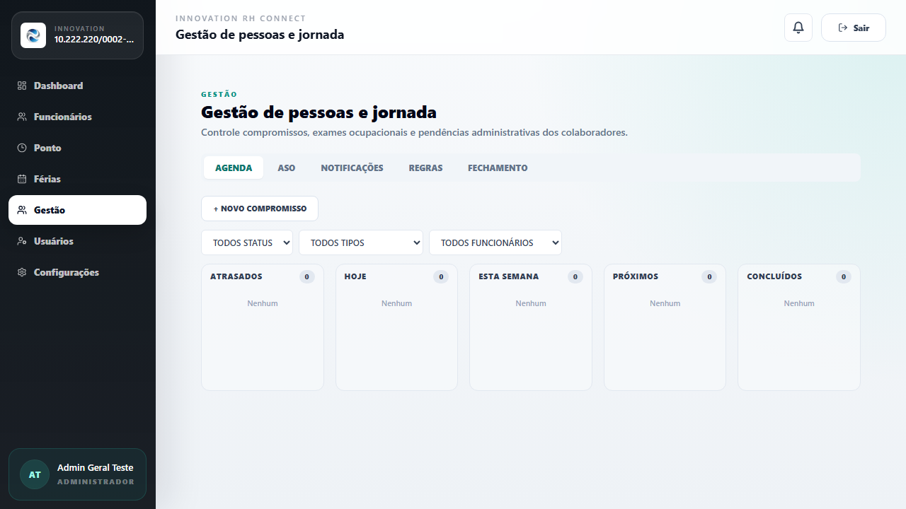

# 🚀 Innovation RH Connect

Um sistema corporativo *premium* e completo para Gestão de Recursos Humanos, controle eletrônico de jornada e comunicação inteligente. Projetado com foco absoluto em usabilidade (UX/UI), segurança e alta performance para revolucionar e automatizar o Departamento Pessoal de médias e grandes empresas.

🔗 **Acesso ao Sistema Ao Vivo:** [https://vps8369.panel.icontainer.net/](https://vps8369.panel.icontainer.net/)

---

## 🆕 Últimas Atualizações (v1.1.0)

- **Importação de Funcionários Avançada:** Corrigido fluxo completo de importação de funcionários via planilhas Excel (`.xlsx`) com suporte robusto a uploads.
- **Integração Completa Asaas:** Ajustes finos no redirecionamento do checkout, setup da empresa e prevenção anti-bloqueio (Rate Limit).
- **Recuperação e Reset de Senhas:** Fluxo de redefinição e recuperação de senhas 100% estabilizado e seguro.
- **Novas Demonstrações (UI):** Documentação (este README) atualizada com as imagens reais das interfaces atuais do sistema.

---

## 📸 Conheça o Sistema

Abaixo estão as principais interfaces da plataforma, construídas com um design moderno, limpo e responsivo:

### 📊 1. Painel Executivo (Dashboard)
<p align="center">
  
</p>
<p align="justify">
  <b>Visão consolidada da operação de RH em tempo real.</b> Acompanhe métricas vitais como funcionários ativos, jornadas registradas no dia, saldo do banco de horas global e alertas críticos (férias pendentes, alertas cadastrais e aniversariantes).
</p>

<hr>

### 👥 2. Cadastro da Equipe (Funcionários)
<p align="center">
  
</p>
<p align="justify">
  <b>Módulo centralizado para gestão do quadro de colaboradores.</b> Listagem interativa com filtros avançados, exibição de status, departamento, cargo e nível de acesso ao sistema, permitindo ações rápidas como edição, desligamento e acesso rápido ao espelho de ponto.
</p>

<hr>

### 🏖️ 3. Gestão de Férias
<p align="center">
  
</p>
<p align="justify">
  <b>Módulo completo para solicitação, aprovação e acompanhamento de férias.</b> Visualização em calendário, cálculo automático de saldo, regras de vencimento e integração fluida com a folha de ponto da equipe.
</p>

<hr>

### ⏱️ 4. Folha de Ponto (Gestão de Jornada)
<p align="center">
  
</p>
<p align="justify">
  <b>Painel do gestor e do RH para acompanhamento do espelho de ponto.</b> Visão consolidada por colaborador mostrando as horas trabalhadas e saldos (positivos ou negativos) no mês selecionado, permitindo auditoria detalhada, aprovação em lote e exportação simplificada.
</p>

<hr>

### 📅 5. Gestão de RH (Agenda & Operacional)
<p align="center">
  
</p>
<p align="justify">
  <b>Módulo administrativo para organização da rotina do departamento pessoal.</b> Gestão de compromissos, exames ocupacionais (ASO), notificações e regras de negócio da jornada. Possui visualização intuitiva em calendário (Agenda) e formato Kanban para facilitar o acompanhamento de pendências.
</p>

---

## 🛠️ Stack Tecnológica

O sistema utiliza o que há de mais moderno na engenharia de software para garantir estabilidade, segurança e velocidade:

### 🎨 Frontend (Web App)
- **Framework:** Next.js 14 (App Router)
- **Linguagem:** TypeScript
- **Estilização:** Tailwind CSS & Framer Motion (para micro-animações fluidas)
- **Gráficos & Componentes:** Recharts, Lucide Icons

### ⚙️ Backend (API RESTful)
- **Framework:** NestJS (Node.js)
- **Linguagem:** TypeScript
- **Banco de Dados & ORM:** PostgreSQL + Prisma ORM
- **Cache & Filas:** Redis
- **Segurança:** Autenticação robusta (JWT persistente), Helmet, Throttler, Cookie Parser

---

## 🛡️ Segurança e Rate Limiting

O sistema possui proteção contra ataques de força bruta e abusos da API configurada globalmente através do `ThrottlerGuard`:
- **Global**: 20 requisições por minuto (60s).
- **Login (`/auth/login`)**: 5 requisições a cada 15 minutos.
- **Registro (`/auth/register-company`)**: 3 requisições a cada 30 minutos.
- **Recuperação de Senha (`/auth/password-reset/request`)**: 5 requisições a cada 30 minutos.

---

## 🚀 Como Rodar Localmente (Desenvolvimento)

1. **Instale as dependências:**
   ```bash
   npm install
   ```

2. **Inicie o banco de dados local via Docker:**
   ```bash
   docker compose -f docker-compose.yml up -d postgres
   ```

3. **Gere o Prisma Client e execute as Migrações:**
   ```bash
   npm run db:generate
   npm run db:migrate
   npm run db:seed
   ```

4. **Inicie os servidores de desenvolvimento:**
   - **Backend API:** `npm run dev:api` (porta `3333`)
   - **Frontend Web:** `npm run dev:web` (porta `3000`)

---

## 🚢 Deploy de Produção (VPS)

Para rodar o ambiente de produção completo utilizando a infraestrutura conteinerizada via Docker Compose:

1. **Copie o arquivo de variáveis de ambiente de produção:**
   ```bash
   cp .env.prod.example .env
   ```
2. **Preencha os valores do `.env` adequadamente (Senhas, Secrets do JWT, etc).**

3. **Inicie os containers de Produção em segundo plano:**
   ```bash
   docker compose -f docker-compose.prod.yml up -d --build
   ```

---

## 🗄️ Comandos de Banco de Dados (Prisma)

Comandos úteis para manutenção da estrutura do banco (schema `apps/api/prisma/schema.prisma`):

```bash
npm run db:generate  # Gera/Atualiza as tipagens locais do Prisma Client
npm run db:migrate   # Cria e executa uma nova migration de desenvolvimento
npm run db:deploy    # Executa migrations pendentes no banco de produção
npm run db:studio    # Abre a interface gráfica do banco (Admin)
```

---

## 📜 Licença e Propriedade

Este software é **PROPRIETÁRIO**.  
O uso, cópia, modificação ou distribuição não autorizada (comercial ou não comercial) é estritamente proibida. Para mais detalhes sobre uso e direitos, consulte o arquivo [LICENSE](LICENSE) na raiz do projeto.