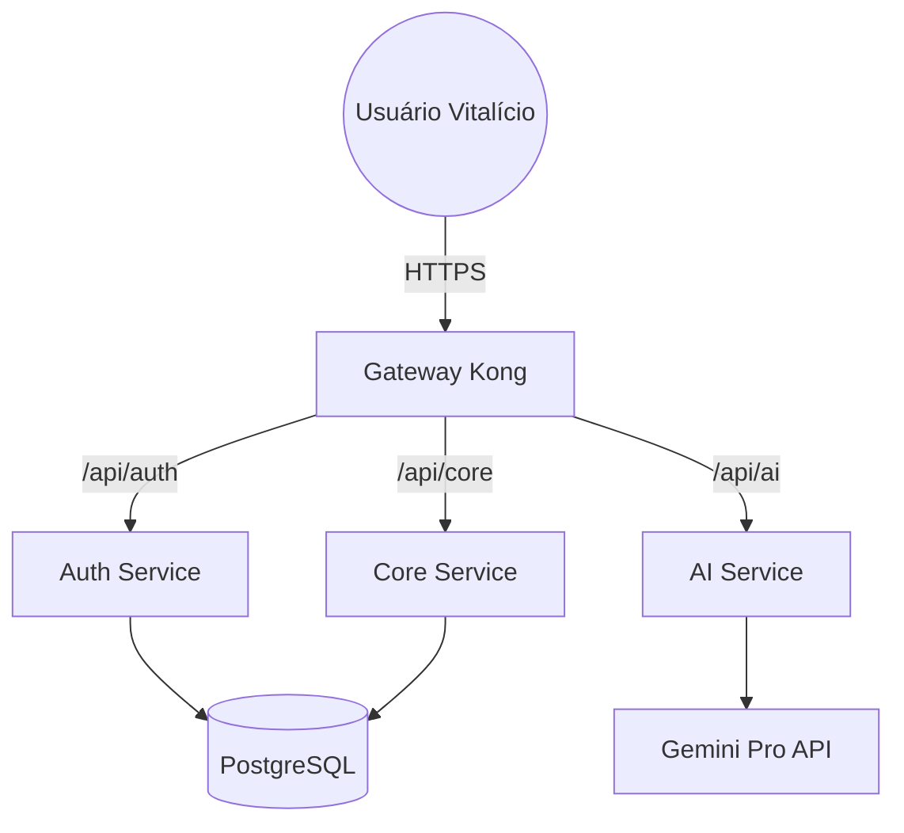

#  INNOVATION.IA — Enterprise OS

---

## ⚠️ AVISO LEGAL E DE PROPRIEDADE INTELECTUAL

> [!IMPORTANT]
> **SISTEMA PRIVADO E ESTRITAMENTE CONFIDENCIAL**  
> Este software é propriedade intelectual exclusiva de **Eduardo Silva / Innovation.ia**.  
> 
> **RESTRIÇÕES RÍGIDAS:**
> - 🚫 **PROIBIDA** a cópia ou reprodução total ou parcial.
> - 🚫 **PROIBIDA** a venda, sublicenciamento ou exploração comercial por terceiros.
> - 🚫 **PROIBIDA** a distribuição em repositórios públicos ou privados sem autorização.
> - 🚫 **PROIBIDA** a engenharia reversa para fins de plágio.
>
> Qualquer violação destes termos resultará em medidas legais imediatas conforme a Lei de Direitos Autorais e Propriedade Intelectual.

---

## 💎 Visão Geral
A **Innovation.ia** é uma plataforma SaaS *Next-Gen* que orquestra todo o ecossistema empresarial em um único sistema operacional de elite. Desenvolvida com arquitetura de microserviços de alta performance, a plataforma unifica inteligência artificial, recrutamento avançado e gestão financeira.

### 🚀 Módulos Nucleares
- **ATS Intelligence**: Triagem e ranking de candidatos impulsionados por IA (Gemini/LLMs).
- **Core Business**: Gestão de projetos, missões e gamificação de produtividade.
- **Finance Hub**: Fluxo de caixa, integração com gateways de pagamento e auditoria.
- **AI Engine**: Integração profunda com modelos de linguagem para análise comportamental.
- **Security Portal**: Gateway de autenticação robusto com RBAC (Role-Based Access Control).

---

## 🛠 Atributos Técnicos

### Backend (Microserviços)
- **FastAPI**: Processamento assíncrono de alta velocidade.
- **SQLAlchemy & Alembic**: Gestão de base de dados relacional (PostgreSQL).
- **JWT Extended**: Segurança de nível bancário para sessões.
- **AsyncIO**: Startup resiliente e não-bloqueante.

### Frontend (User Experience)
- **Next.js 16**: Performance SSR e renderização híbrida.
- **Tailwind CSS**: Design system sofisticado com Glassmorphism.
- **Framer Motion**: Micro-interações e animações premium.
- **Lucide Icons**: Iconografia minimalista e moderna.

### Infraestrutura & DevOps
- **Docker & Docker Compose**: Orquestração de containers.
- **Kong Gateway**: Roteamento inteligente e proteção de APIs.
- **Nginx**: Proxy reverso e terminação SSL/TLS.
- **Self-Healing Startup**: Capacidade de auto-correção e espera por dependências.

---

## 📐 Arquitetura do Sistema

---

## 🔒 Contato e Aquisição
O acesso a este repositório é restrito apenas a desenvolvedores autorizados e investidores. Se você recebeu este acesso para avaliação técnica:

1. **Não compartilhe** credenciais ou screenshots publicamente.
2. **Respeite** o Segredo de Negócio da arquitetura.
3. Para propostas comerciais ou licenciamento Enterprise: [eduardo@innovation.ia](mailto:eduardo@innovation.ia)

---

  <b>Innovation.ia &copy; 2026 — O Futuro do Enterprise OS</b>

