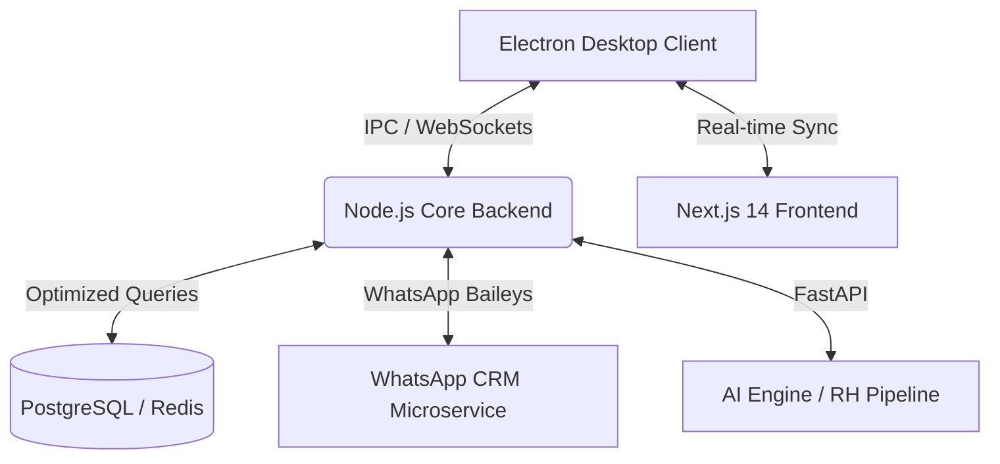

# ⚡ Innovation IA - Enterprise Platform

**A next-gen SaaS ecosystem designed to automate corporate operations. Built with high-performance engineering, event-driven architecture, and state-of-the-art UI/UX for Banking, HR, and CRM.**

---

## 🏗️ System Architecture & Engineering

Innovation IA is a decoupled microservices ecosystem designed for high availability, low latency, and massive scalability. The frontend leverages a robust **Next.js 14 App Router** architecture, styled with a custom high-end banking-grade design system, providing a premium Enterprise experience.

### 🧠 Technical Highlights (Engineering Excellence)

- **Enterprise-Grade UI/UX:** A bespoke design system built natively with CSS (`globals.css`), featuring custom components (`dash-card`, `table-premium`), strict typography tracking (Inter), and dynamic, SSR-safe `recharts` data visualizations.
- **Event-Driven Messaging:** Bi-directional real-time communication via WebSockets, ensuring sub-second latency for message delivery across the WhatsApp CRM.
- **AI-Powered Pipeline:** Deep integration with **Gemini 1.5 Pro** for automated resume parsing (OCR), DISC behavioral analysis, and autonomous candidate triaging.
- **Hybrid Persistence Layer:** Uses **Prisma ORM** for relational corporate data and **Redis** for high-frequency Kanban state management.

---

## 🚀 Key Modules & Capabilities

<table>
  <tr>
    <td width="50%">
      <h3>💼 Financial Operations (DDA/Bank)</h3>
      Complete banking-grade financial module. Features real-time cash flow area charts, DDA integration mockups, detailed ledger management (entradas/saídas), and an interactive commercial proposal calculator.
    </td>
    <td width="50%">
      <h3>🤖 WhatsApp CRM & Automation</h3>
      Full-stack CRM built on Baileys. Non-blocking asynchronous routing capable of processing inbound traffic without locking the Node.js Event Loop, featuring humanized AI response delays.
    </td>
  </tr>
  <tr>
    <td width="50%">
      <h3>👔 Strategic HR (ATS)</h3>
      Applicant Tracking System with an automated Kanban pipeline. Candidate scoring (95% fit cultural accuracy), advanced analytics, and 24/7 automated WhatsApp triaging.
    </td>
    <td width="50%">
      <h3>📸 AI Media & Creative</h3>
      Internal tools for media generation and processing. Leveraging NVIDIA and Gemini APIs for automated content creation and optimization.
    </td>
  </tr>
  <tr>
    <td width="50%">
      <h3>👥 Colaboradores Management</h3>
      Advanced employee management module. Track collaborators, manage profiles, performance metrics, and team organization with real-time synchronization.
    </td>
    <td width="50%">
      <h3>⏱️ Ponto (Time Tracking)</h3>
      Complete time and attendance tracking system. Clock in/out management, absence tracking, overtime calculation, and compliance reporting with audit trails.
    </td>
  </tr>
  <tr>
    <td width="50%">
      <h3>🔐 Privacy & Compliance</h3>
      Enterprise-grade privacy module with GDPR/LGPD compliance. Consent management, audit trails, data anonymization, and regulatory compliance tracking for all user interactions.
    </td>
    <td width="50%">
    </td>
  </tr>
</table>

---

## 🛠️ Tech Stack & Tooling

| Layer | Technologies |
|-------|--------------|
| **Frontend** | Next.js 14, TypeScript, Recharts, Custom Banking CSS, Lucide Icons |
| **Backend** | Node.js (TypeScript), FastAPI (Python), Prisma ORM |
| **Desktop** | Electron, IPC Communication, Native Windows Integration |
| **Database** | PostgreSQL (Relational), Redis (Cache/States) |
| **AI/ML** | Gemini 1.5 Pro, GPT-4o, NVIDIA API |
| **Integrations** | Baileys (WhatsApp), Asaas (Payments), Stripe |

---

## 🚀 Getting Started

### Prerequisites
- Node.js 18+
- Python 3.10+
- PostgreSQL & Redis

### Installation
1. Clone the repository
2. Install dependencies: `npm run bootstrap`
3. Set up `.env` with your API keys (Gemini, Database, etc.)
4. Launch the ecosystem: `.\INICIAR_INNOVATION.bat` ou utilize o novo script `.ps1` otimizado para Windows.

---

## 🎯 Impact & ROI
- **Financial Clarity:** Zero-delay financial tracking with SSR-optimized visual reporting.
- **Time-to-Hire:** Reduced by 70% through automated triaging.
- **Efficiency:** Capable of screening 1,000+ candidates per day with zero human intervention.

---

<i>Architected for Scale. Built for Performance. Designed for Enterprise.</i>

**Innovation IA © 2026 — Enterprise-Grade Platform**

