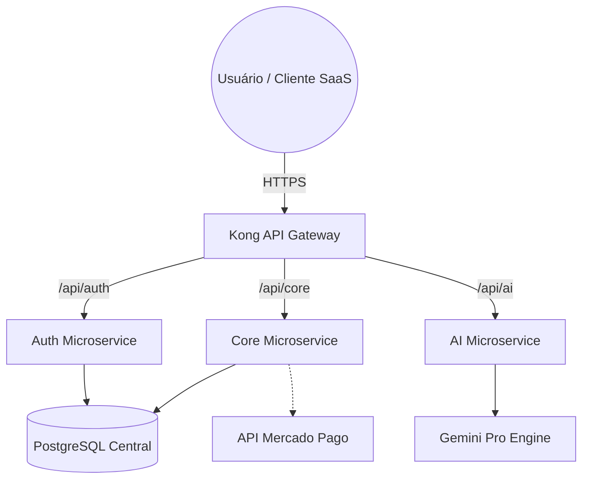

#  INNOVATION.IA — Enterprise OS (SaaS Edition V1.0)

---

## ⚠️ AVISO LEGAL E DE PROPRIEDADE INTELECTUAL

> [!IMPORTANT]
> **SISTEMA PRIVADO E ESTRITAMENTE CONFIDENCIAL**  
> Este software é propriedade intelectual exclusiva de **Eduardo Silva / Innovation.ia**.  
> 
> **RESTRIÇÕES RÍGIDAS:**
> - 🚫 **PROIBIDA** a cópia ou reprodução total ou parcial.
> - 🚫 **PROIBIDA** a venda, sublicenciamento ou exploração comercial por terceiros.
> - 🚫 **PROIBIDA** a distribuição em repositórios públicos ou privados sem autorização.
> - 🚫 **PROIBIDA** a engenharia reversa para fins de plágio.
>
> Qualquer violação destes termos resultará em medidas legais imediatas conforme a Lei de Direitos Autorais e Propriedade Intelectual.

---

## 💎 Visão Geral (V1.0 Production)
A **Innovation.ia** é uma plataforma SaaS *Next-Gen* totalmente funcional e pronta para o mercado. Orquestra todo o ecossistema empresarial em um único sistema operacional de elite. Desenvolvida com arquitetura de microserviços de alta performance, a plataforma unifica inteligência artificial, recrutamento avançado, gestão financeira e analytics em tempo real.

### 🚀 Módulos Nucleares Ativos
- **Innovation AI Chat**: Assistente virtual avançado integrado diretamente com LLMs de última geração, oferecendo suporte contextual, análise de dados e automação de tarefas.
- **Finance & Analytics Hub**: Fluxo de caixa em tempo real, dashboards analíticos detalhados, e integração completa com o **Mercado Pago** para assinaturas SaaS e pagamentos financeiros.
- **ATS Intelligence**: Triagem e ranking de currículos interativos impulsionados por IA (Gemini).
- **Gerenciamento de Chaves de IA**: Sistema de rotação dinâmica de múltiplas chaves API para modelos avançados (incluindo Gemini e Veo para geração de vídeo), garantindo 100% de uptime e escalabilidade horizontal.
- **Core Business**: Gestão de projetos, missões e gamificação de produtividade corporativa.
- **Security Portal**: Gateway de autenticação centralizado e impenetrável via Kong, com controle de acesso baseados em funções (RBAC).

---

## 🛠 Stack Tecnológico Consolidado

### Backend (Microserviços)
- **FastAPI**: Processamento assíncrono hiper-veloz para rotas da API.
- **PostgreSQL & SQLAlchemy**: Integridade referencial e alta disponibilidade de dados.
- **Arquitetura Desacoplada**: Serviços independentes de Auth, AI e Core para escalabilidade horizontal.

### Frontend (User Experience Premium)
- **Next.js 16**: Renderização híbrida impecável e navegação fluida.
- **Tailwind CSS & Framer Motion**: Design system de ponta, glassmorphism e micro-interações responsivas.
- **Integração de Pagamentos**: Checkout nativo e seguro otimizado para conversão.

### Infraestrutura & DevOps (Enterprise Grade)
- **Docker & Docker Compose**: Orquestração completa do ambiente local e produtivo.
- **Kong API Gateway**: Roteamento unificado, proxy reverso seguro e proteção contra abusos.
- **Monitoramento & Self-Healing**: Scripts de manutenção e reparo automatizados (`reparo_total.sh`, `iniciar_local.ps1`) para garantir 99.9% de uptime funcional.

---

## 📐 Arquitetura do Sistema Final

---

## 🔒 Licenciamento e Contato Corporativo
O acesso a este código-fonte é restrito a desenvolvedores autorizados e stakeholders diretos.

1. **Confidencialidade Extrema**: Não compartilhe credenciais, rotas de API ou prints da infraestrutura interna.
2. **Uso Comercial**: O licenciamento e operação deste SaaS são geridos exclusivamente pelo criador.
3. Para propostas de aquisição, parcerias ou suporte corporativo corporativo: [eduardo@innovation.ia](mailto:eduardo@innovation.ia)

---

  <b>Innovation.ia &copy; 2026 — O Futuro do Enterprise OS</b> 
  <i>Ready for the World.</i>

