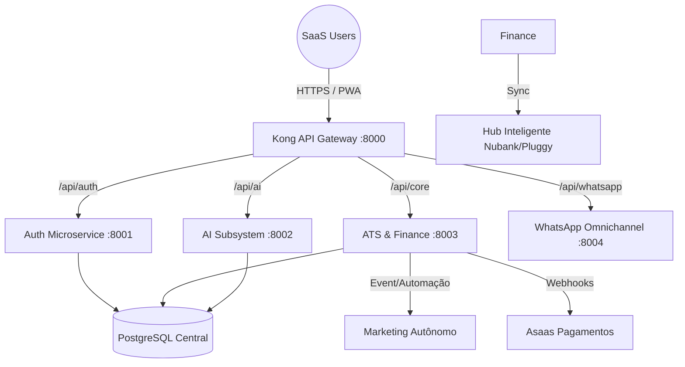

#  INNOVATION.IA — Super ERP Cognitivo (V2.0 @Pro)

A **Innovation.ia** evoluiu de um Dashboard de IA para o **Sistema Operativo Central (ERP + ATS + Marketing)** definitivo. Nosso objetivo é substituir ecossistemas legados e fragmentados por uma plataforma única, nativa em IA, onde a empresa opera 100% do seu tempo de forma hiperautomatizada.

---

## 💎 As 3 "Killer Features" B2B (Diferenciais Exclusivos)

Acabamos de integrar um novo arsenal B2B focado em **Zero-Touch Operation**, projetado especificamente para que nossos clientes B2B substituam concorrentes caríssimos no mercado:

### 1. 📱 Recrutador e RH Omnichannel (WhatsApp AI Integrado)
O ATS e o RH não usam mais apenas o e-mail. Construímos um **Microserviço Node.js/Baileys** 100% dedicado rotendo pelo Kong.
*   **Ação:** O candidato aplica no portal "Careers". Imediatamente o WhatsApp oficial da empresa envia: *"Olá, vi sua inscrição! Vamos fazer uma rápida entrevista por aqui?"*
*   **Magia:** IA filtra o candidato na primeira etapa de conversas via WhatsApp, poupando centenas de horas de Headhunters.

### 2. 🧩 Construtor de Automação Visual (O seu "Zapier" Interno)
Incorporamos nosso aclamado **FlowBuilder Visual Drag-and-Drop** de versões anteriores nativamente dentro do ecossistema V2.
*   **Ação:** Donos de empresas agora criam fluxos visuais complexos: `[Novo Funcionário Registrado] ➡️ [IA gera Contrato no Google Docs] ➡️ [Bot envia Docusign e WhatsApp]` sem escrever uma linha de código.

### 3. 📢 Gerente de Marketing Autônomo (Auto-Employer Branding)
O que antes era feito manualmente agora é _Zero-Touch_. Integramos nossos scripts avançados "Prosolution" para o serviço de Marketing.
*   **Ação:** O setor de RH cria uma vaga de Dev na plataforma.
*   **Magia:** O microserviço imediatamente aciona a IA para desenhar templates/copy, gerar hashtags para conversão corporativa, e **posta automaticamente** a vaga no Instagram e LinkedIn corporativos utilizando uma arquitetura _headless_.

---

## 🔒 Segurança de Nível Bancário (Bank-Grade Security)
A plataforma Innovation.ia foi construída com os mais rigorosos padrões de segurança:
- **Criptografia e Rastreio Distribuído:** Middleware de *Correlation-ID* para rastreamento ponta-a-ponta. Autenticação JWT roscada a Microserviços (sem monolitos quebráveis).
- **Proteção Contra Injeção e XSS:** Políticas estritas de CSP (Content-Security-Policy).
- **Anti-Sniffing:** Configurações de cabeçalhos nosniff garantem a integridade dos arquivos confidenciais.
- **Blindagem do Servidor:** Gateway focado (Kong API Gateway) orquestrando ratelimits e interceptando tráfego na linha de frente (`localhost:8000`).

---

## 📁 Arquitetura do Ecossistema (Microserviços)

O sistema foi refatorado do conceito monolítico para uma operação pronta para "Enterprise" orquestrada puramente em containers com *Wait-For-Postgres* para garantia contra *race conditions*:

- **`apps/backend/`**: O coração FastAPI quebrado em Entrypoints isolados:
  - `auth_main.py`: Serviço de Credenciais.
  - `core_main.py`: ATS de Vagas, Kanban e Finanças.
  - `ai_main.py`: Microsserviço robusto pesado para IA/GenAI.
- **`apps/whatsapp_service/`**: Microserviço autônomo (Express + Baileys) integrado ao RMQ/HTTP.
- **`apps/frontend/`**: Interface de usuário premium (Next.js) potencializado com **TanStack Query** para caching hiperveloz.
- **`apps/gateway/`**: Kong API mapeando a porta unificada.

---

## 🛠 Módulos Complementares

### 💰 Finanças Zero Papel
- **Scanner Inteligente**: Upload de PDFs ou Fotos que extrai automaticamente Fornecedor, Valor, Data e Itens integrado ao webhook do *Asaas* ativando pagamentos e fluxo em tempo real.
- **Cash Flow Prediction**: Previsão preditiva e gestão de pagadoria de folha do próprio ATS.

###  Ponto Militar Biométrico
- **Segurança Antifraude**: Reconhecimento Facial integrado e validação rigorosa de GPS com detecção de Mock Location.

### 🤖 AI Key Manager
- **Resiliência Total**: Rotação dinâmica de chaves Gemini/Veo/Claude/Mistral para garantir 100% de disponibilidade. Não dependemos de uma só nuvem!

---

## 📈 Roadmap para o Futuro Próximo

- **Fase 3 (Próxima)** : Integração Governamental Direta (SEFAZ/NF-e) com Agente de Auditoria Fiscal IA.
- **Fase 4** : Conciliação Bancária 100% Autônoma Operada via Chat estilo "Jarvis Financeiro" + Dashboard Híbrido Web3.

---

## ⚠️ PROPRIEDADE INTELECTUAL
**SISTEMA PRIVADO E CONFIDENCIAL** — Propriedade exclusiva de **Eduardo Silva / Innovation.ia**.  
Qualquer reprodução ou distribuição sem autorização é estritamente proibida e sujeita a penalidades legais agressivas.

---

  <b>Innovation.ia &copy; 2026 — O Futuro do Enterprise OS</b> 
  <i>Designed for Dominance.</i>

