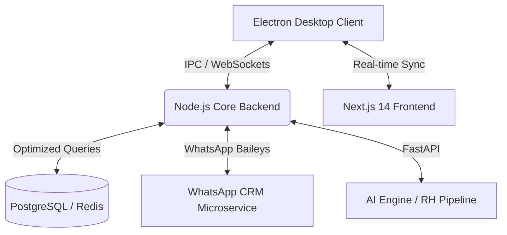

# ⚡ Innovation IA - Enterprise Platform

**A next-gen SaaS ecosystem designed to automate 90% of corporate recruitment and CRM operations. Built with high-performance engineering, event-driven architecture, and state-of-the-art AI integration.**

---

## 🏗️ System Architecture & Engineering

Innovation IA is not just a dashboard; it's a decoupled microservices ecosystem designed for high availability, low latency, and massive scalability. It leverages a hybrid approach of **Next.js** for a glassmorphism-rich web experience and **Electron** for native OS-level performance.

### 🧠 Technical Highlights (Engineering Excellence)

- **Event-Driven Messaging:** Bi-directional real-time communication via WebSockets, ensuring sub-second latency for message delivery and status synchronization across hundreds of concurrent users.
- **AI-Powered Pipeline:** Deep integration with **Gemini 1.5 Pro** for automated resume parsing (OCR), DISC behavioral analysis, and automated candidate interview triaging.
- **Hybrid Persistence Layer:** Uses **Prisma ORM** for relational corporate data and **Redis** for high-frequency Kanban state management, ensuring O(1) complexity for pipeline transitions.
- **Enterprise-Grade Security:** Strict isolation of proprietary tokens, protected environment variables, and binary hardening for the Electron executable to prevent reverse engineering.

---

## 🚀 Key Modules & Capabilities

<table>
  <tr>
    <td width="50%">
      <h3>🤖 WhatsApp CRM & Automation</h3>
      Full-stack CRM built on Baileys. Non-blocking asynchronous routing capable of processing massive inbound traffic without locking the Node.js Event Loop.
    </td>
    <td width="50%">
      <h3>👔 Strategic HR (ATS)</h3>
      Complete Applicant Tracking System. Automated candidate scoring (95% fit cultural accuracy), Kanban management, and 24/7 automated WhatsApp triaging.
    </td>
  </tr>
  <tr>
    <td width="50%">
      <h3>💰 Finance & SaaS Engine</h3>
      Integrated with **Asaas** and **Stripe**. Features automated subscription billing, multi-tenancy auth, and real-time revenue analytics dashboards.
    </td>
    <td width="50%">
      <h3>📸 AI Media & Creative</h3>
      Internal tools for media generation and processing. Leveraging NVIDIA and Gemini APIs for automated content creation and optimization.
    </td>
  </tr>
</table>

---

## 🛠️ Tech Stack & Tooling

| Layer | Technologies |
|-------|--------------|
| **Frontend** | Next.js 14, TypeScript, Tailwind CSS, Framer Motion, Lucide Icons |
| **Backend** | Node.js (TypeScript), FastAPI (Python), Prisma ORM |
| **Desktop** | Electron, IPC Communication, Native Windows Integration |
| **Database** | PostgreSQL (Relational), Redis (Cache/States) |
| **AI/ML** | Gemini 1.5 Pro, GPT-4o, NVIDIA API |
| **Integrations** | Baileys (WhatsApp), Asaas (Payments), Stripe |

---

## 🚀 Getting Started

### Prerequisites
- Node.js 18+
- Python 3.10+
- PostgreSQL & Redis

### Installation
1. Clone the repository
2. Install dependencies: `npm run bootstrap`
3. Set up `.env` with your API keys (Gemini, Database, etc.)
4. Launch the ecosystem: `.\INICIAR_INNOVATION.bat`

---

## 🎯 Impact & ROI
- **Time-to-Hire:** Reduced by 70% through automated triaging.
- **Cost-per-Hire:** Reduced by 65% by eliminating manual CV screening.
- **Efficiency:** Capable of screening 1,000+ candidates per day with zero human intervention.

---

<i>Architected for Scale. Built for Performance. Developed for the Future of Work.</i>

**Innovation IA © 2024 — Enterprise-Grade Recruitment Automation**

