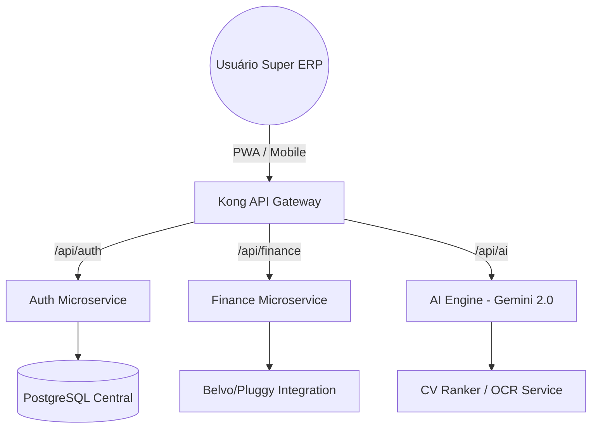

#  INNOVATION.IA — Super ERP Cognitivo (V2.0)

## 🔒 Segurança de Nível Bancário (Bank-Grade Security)
A plataforma Innovation.ia foi construída com os mais rigorosos padrões de segurança, garantindo que nenhum dado seja interceptado ou roubado.
- **Criptografia de Ponta-a-Ponta:** Utilizamos protocolos de segurança avançados (HSTS) para forçar conexões sempre criptografadas (HTTPS).
- **Proteção Contra Injeção e Execução de Scripts:** Políticas estritas de CSP (Content-Security-Policy) previnem a execução de códigos maliciosos.
- **Anti-Sniffing e XSS:** Configurações de cabeçalhos nosniff e proteção XSS ativa garantem a integridade dos arquivos (como notas fiscais) e protegem as interfaces.
- **Blindagem do Servidor:** Ocultamento de versões do servidor e frameworks (Nginx, Next.js) para mitigar fingerprinting e evitar ataques direcionados.
- Nenhuma senha, arquivo ou transação trafega sem a máxima segurança, tornando o sistema confiável como um banco.

---

## 🚀 A Visão: Super ERP Cognitivo
A **Innovation.ia** evoluiu de um Dashboard de IA para o **Sistema Operativo Central (ERP + ATS)** definitivo. Nosso objetivo é substituir ecossistemas legados e fragmentados por uma plataforma única, nativa em IA, onde a empresa opera 100% do seu tempo.

### 💎 O que nos torna Superiores?
- **Pilar 1: ATS de Elite**: Recrutamento autônomo com Ranking via RAG e Kanban de alta performance.
- **Pilar 2: Finanças "Zero Papel"**: OCR avançado com Gemini 2.0 Flash para leitura de notas e recibos sem digitação manual.
- **Pilar 3: Automação n8n & WhatsApp**: Integração profunda com mensageria para processos de RH e suporte.

---

## 🛠 Módulos em Destaque (Fase 1 Atualizada)

### 📊 ATS Intelligence & Kanban
- **Alta Performance**: Interface inspirada no Trello com animações fluidas (Framer Motion).
- **Match Score IA**: Visualização direta da compatibilidade do candidato no card do Kanban.

### 💰 Finanças Zero Papel
- **Scanner Inteligente**: Upload de PDFs ou Fotos que extrai automaticamente Fornecedor, Valor, Data e Itens.
- **Cash Flow Prediction**: Previsão de fluxo de caixa baseada em comportamento histórico.

### 🤖 AI Key Manager
- **Resiliência Total**: Rotação dinâmica de chaves Gemini/Veo para garantir 100% de disponibilidade.

---

### � Ponto Militar Biométrico
- **Segurança Antifraude**: Reconhecimento Facial integrado e validação rigorosa de GPS com detecção de Mock Location.

### 🏦 Hub Bancário Open Finance
- **Consolidação em Tempo Real**: Visualização de múltiplas contas (Inter, Nubank, Itaú) em uma interface unificada.

---

## 📈 Roadmap para o Futuro Próximo

- **Fase 3 (Próxima)** : Integração Governamental Direta ( SEFAZ/NF-e ) e Super ATS com Entrevistas Automáticas via n8n.
- **Fase 4** : Conciliação Bancária 100% Autônoma (XML + DDA + Extrato)

---

## 📐 Arquitetura do Ecossistema

---

## ⚠️ PROPRIEDADE INTELECTUAL
**SISTEMA PRIVADO E CONFIDENCIAL** — Propriedade exclusiva de **Eduardo Silva / Innovation.ia**.  
Qualquer reprodução ou distribuição sem autorização é estritamente proibida e sujeita a penalidades legais.

---

  <b>Innovation.ia &copy; 2026 — O Futuro do Enterprise OS</b> 
  <i>Designed for Dominance.</i>

