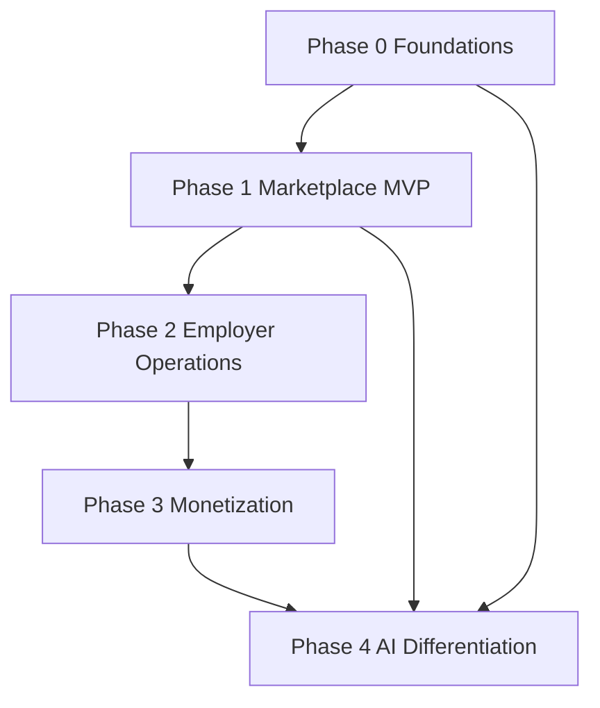

# Roadmap to InfoJobs-Level Capabilities

## Purpose
Deliver a structured, phased roadmap to reach InfoJobs-level capabilities across Candidate app, Company web, Platform, and AI. This roadmap includes dependencies, priorities, assumptions, milestones, non-functional requirements, risks, and KPIs.

## Scope Mapping to User Checklist
| Checklist Area | Requested Bullets | Planned Work Items |
| --- | --- | --- |
| Candidate app | onboarding | Account creation, identity verification, consent flows, preference setup, guided onboarding UX |
| Candidate app | profile | Profile data model, editable profile UI, privacy controls, portfolio/skills sections |
| Candidate app | CV builder | CV templates, import/export, document generation service, versioning |
| Candidate app | job search | Search UI, filters, saved searches, alerting, search backend |
| Candidate app | applications | Application workflow, status tracking, attachments, withdrawal |
| Candidate app | messaging | Candidate-employer messaging, inbox, notifications integration |
| Candidate app | notifications | Email/push/SMS strategy, preference center, event-driven triggers |
| Company web | employer profile | Company pages, branding assets, verification, reviews policy |
| Company web | job posting | Job creation workflow, templates, approvals, posting lifecycle |
| Company web | applicant tracking | Applicant pipeline, stages, notes, collaboration, exports |
| Company web | talent search | Resume search, filters, saved talent lists, outreach |
| Platform | auth | Authentication, authorization, RBAC, SSO support |
| Platform | payments | Billing, invoicing, plans, metering, refunds |
| Platform | analytics | Event tracking, dashboards, funnel reporting |
| Platform | moderation | Content review, abuse reporting, policy enforcement |
| Platform | CMS | Marketing pages, FAQs, legal content management |
| AI | matching | Candidate-job matching models, feature store, feedback loop |
| AI | ranking | Search ranking, relevance tuning, A/B testing |
| AI | recommendations | Personalized jobs, employer recommendations |
| AI | parsing | Resume parsing, job description parsing, entity extraction |

## Phased Roadmap

### Phase 0: Foundations and Compliance
**Goals**: Platform baseline, data model, security, compliance readiness.

**Key work**
- Core data model for candidates, employers, jobs, applications
- Auth and RBAC scaffolding, audit logging
- CMS baseline for content
- Analytics event taxonomy and instrumentation plan
- Moderation policy and tooling requirements definition

**Dependencies**
- Required before any user-facing flows or AI training pipelines

**Priority**: P0

### Phase 1: Marketplace MVP
**Goals**: Enable basic candidate-job interaction and employer postings.

**Key work**
- Candidate onboarding, profile, CV builder v1
- Job search UI, filters, saved searches
- Job posting workflow and employer profile v1
- Application workflow with status tracking
- Notifications foundation for critical events

**Dependencies**
- Phase 0 data model and auth
- Analytics taxonomy for funnel measurement

**Priority**: P0

### Phase 2: Employer Operations and ATS-lite
**Goals**: Employer efficiency and collaboration.

**Key work**
- Applicant tracking pipeline stages, notes, collaboration
- Talent search across resumes
- Messaging between candidates and employers
- Moderation tooling for job postings and messages

**Dependencies**
- Phase 1 application workflow
- Phase 0 moderation policy and auth

**Priority**: P1

### Phase 3: Monetization and Growth
**Goals**: Revenue readiness and growth loops.

**Key work**
- Payments, plans, invoicing, refunds
- Premium job posting options and boosts
- Employer analytics dashboards
- Candidate notification preferences and alerts

**Dependencies**
- Phase 1 and 2 stable workflows
- Analytics instrumentation from Phase 0

**Priority**: P1

### Phase 4: AI-Driven Differentiation
**Goals**: InfoJobs-level AI for matching and relevance.

**Key work**
- Resume and job description parsing pipeline
- Matching models and ranking pipelines
- Recommendations for candidates and employers
- A/B testing and model monitoring

**Dependencies**
- Sufficient data volume from Phases 1-3
- Analytics and feedback signals

**Priority**: P2

## Dependency Overview

## Recommended Milestones
1. **M0**: Data model, auth, CMS, analytics taxonomy, moderation policy ready
2. **M1**: Candidate onboarding, profile, CV builder v1, search, job posting, applications live
3. **M2**: Applicant tracking, talent search, messaging, moderation workflows live
4. **M3**: Payments, employer analytics, premium job options live
5. **M4**: Parsing, matching, ranking, and recommendations live with monitoring

## Assumptions
- Single-region launch with expansion later
- Initial focus on web experiences, mobile app optional
- SSO for enterprise employers may be deferred to Phase 3
- AI models start with heuristic matching before ML refinement

## Non-Functional Requirements
- **Security**: Data encryption in transit and at rest, RBAC, audit logs
- **Privacy**: Consent management, data retention policies, GDPR/LGPD compliance
- **Performance**: Search latency targets, notification delivery SLAs
- **Reliability**: High availability for job search and applications
- **Scalability**: Modular services for search, messaging, and AI pipelines
- **Observability**: Tracing, metrics, logging for all core flows

## Risks and Mitigations
- **Cold start for AI**: Use rule-based matching initially, collect feedback signals early
- **Content quality**: Enforce moderation and verification for employer profiles and job postings
- **Operational complexity**: Keep ATS-lite scope minimal early, expand based on adoption
- **Compliance delays**: Engage legal and security reviews in Phase 0
- **Data quality**: Validate resume parsing with human review in early stages

## KPIs
- **Marketplace**: job posting to application conversion, search to application rate
- **Candidate**: onboarding completion, profile completeness, application success rate
- **Employer**: time to fill, applicant response rate, ATS pipeline velocity
- **Monetization**: paid employer conversion, revenue per posting, churn rate
- **AI**: match acceptance rate, recommendation CTR, ranking relevance metrics

## Traceability: Checklist to Phases
| Checklist Area | Bullet | Phase |
| --- | --- | --- |
| Candidate app | onboarding | Phase 1 |
| Candidate app | profile | Phase 1 |
| Candidate app | CV builder | Phase 1 |
| Candidate app | job search | Phase 1 |
| Candidate app | applications | Phase 1 |
| Candidate app | messaging | Phase 2 |
| Candidate app | notifications | Phase 1 and Phase 3 |
| Company web | employer profile | Phase 1 |
| Company web | job posting | Phase 1 |
| Company web | applicant tracking | Phase 2 |
| Company web | talent search | Phase 2 |
| Platform | auth | Phase 0 |
| Platform | payments | Phase 3 |
| Platform | analytics | Phase 0 and Phase 3 |
| Platform | moderation | Phase 2 |
| Platform | CMS | Phase 0 |
| AI | matching | Phase 4 |
| AI | ranking | Phase 4 |
| AI | recommendations | Phase 4 |
| AI | parsing | Phase 4 |
